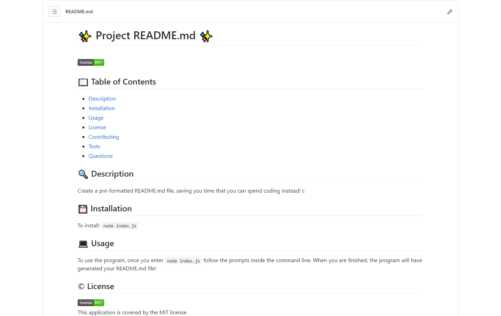

# :sparkles: README.md Generator


Use the command line to automatically generate a pre-formatted README.md file for your project!

## 📖 Table of Contents
- [User Story](#userstory)
- [Installation](#install)
- [Usage](#usage)
- [Result](#result)
- [Questions](#questions)
- [License](#license)

## 👩‍💼 User Story <a name="userstory"></a>
> **AS A** developer <br>
> **I WANT** a README generator <br>
> **SO THAT** I can quickly create a professional README for a new project

## 💾 Installation <a name="install"></a>

To install README.md Generator:
```
npm init -y
npm install index.js
```

## 💻 Usage <a name="usage"></a>
Here is a video walkthrough of a user running the README.md Generator:<br>
[video]

## ⭐ Result <a name="result"></a>

Your README.md file will look something like this:<br>


## 💬 Questions <a name="questions"></a>
Feel free to reach out with any questions!

:octocat: Find me on GitHub: [marina-russ](https://github.com/marina-russ)
<br />
✉️ Email me with any questions: mruss@alumni.nmu.edu

## © License <a name="license"></a>

<br />
This application is covered by the MIT license. 

### 👋 Thanks for taking a look at this repo!
